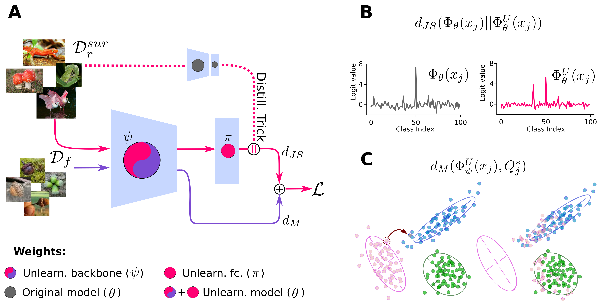

# SCAR: Selective-distillation for Class and Architecture-agnostic unleaRning
[Jacopo Bonato](https://scholar.google.com/citations?user=tC1GFkUAAAAJ&hl=it&authuser=1),[Marco Cotogni](https://scholar.google.com/citations?user=8PUz5lAAAAAJ&hl=it), [Luigi Sabetta](https://scholar.google.com/citations?view_op=list_works&hl=en&user=rQBQQjMAAAAJ)


<!--The paper is available on  []()-->

## Overview

 SCAR is a novel model-agnostic unlearning algorithm named Selective-distillation for Class and Architecture-agnostic unleaRning. SCAR utilizes metric learning and knowledge distillation techniques to efficiently remove targeted information from models without relying on a retain set. By leveraging the Mahalanobis distance, SCAR shifts feature vectors of instances to forget towards distributions of samples from other classes, facilitating effective metric learning-based unlearning. Additionally, SCAR maintains model accuracy by distilling knowledge from the original model using out-of-distribution images.

 Key contributions of this work include the development of SCAR, which achieves competitive unlearning performance without retain data, a unique self-forget mechanism in class removal scenarios, comprehensive analyses demonstrating efficacy across different datasets and architectures, and experimental evidence showcasing SCAR's comparable or superior performance to traditional unlearning methods and state-of-the-art techniques that do not use a retain set.

## Getting Started


### Installation

```bash
# Clone the repository
git https://github.com/jbonato1/SCAR

# Navigate to the project directory
cd your-repo

# Installation WITH DOCKER

#Step 1:

#Build the docker image from the Dockerfile : 
docker build -f Dockerfile -t scar:1.0 . 

#Step 2:

#Run your image : 
docker run -it --gpus all --ipc=host -v "/path_to_dataset_folder":/root/data -v "/path_to_scar_folder":/scar scar:1.0 /bin/bash

# Install LOCALLY 
pip install -r requirements.txt
```

## Code Execution
- Step 1:
    Run
    ```bash 
    python3 training_original.py
    ```
    to train the original model. Choose the dataset in opts
- Step 2:
    Run
    ```bash
    sample_fgt_samples.py
    ```
    to sample the forget sample for HR scenario
- Step 3:
    Run 
    ```bash
    pyhton3 training_oracle.py
    ```
    to train the retrained model. Choose the dataset in opts. Use --mode CR for class removal and --mode HR for homogeneus removal

If you already have trained and retrained model you can skip the above steps.

If you plan to execute the HR scenario,before launching any unlearning method, you have to execute the script sample_fgt_samples.py for generating the indices of the samples to be forgotten.

For reproducing the experiments:
```
python src/main.py --run_name <run_name> --dataset <dataset> --mode <mode> --cuda <cuda> --load_unlearned_model --save_model --save_df --push_results --run_original --run_unlearn --run_rt_model --num_workers <num_workers> --method <method> --model <model> --bsize <bsize> --wd <wd> --momentum <momentum> --lr <lr> --epochs <epochs> --scheduler <scheduler> --temperature <temperature> --lambda_1 <lambda_1> --lambda_2 <lambda_2> --delta <delta> --gamma1 <gamma1> --gamma2 <gamma2>
```
Configuration Options:
 
    --run_name: Name of the run (default: "test").
    --dataset: Dataset for the experiment (default: "cifar100").
    --mode: Mode for the experiment (default: "CR").
    --cuda: Select zero-indexed CUDA device. Use -1 to run on CPU (default: 0).
    --load_unlearned_model: Load a pre-trained unlearned model.
    --save_model: Save the trained model.
    --save_df: Save the experiment results as a DataFrame.
    --push_results: push results on google docs
    --run_original: Run the original model.
    --run_unlearn: Run the unlearned model.
    --run_rt_model: Run the real-time model.
    --num_workers: Number of workers for data loading (default: 4).
    --method: Method for unlearning (default: "SCAR").
    --model: Model architecture (default: 'resnet18').
    --bsize: Batch size (default: 1024).
    --wd: Weight decay (default: 0.0).
    --momentum: Momentum for SGD optimizer (default: 0.9).
    --lr: Learning rate (default: 0.0005).
    --epochs: Number of epochs (default: 30).
    --scheduler: Learning rate scheduler milestones (default: [25, 40]).
    --temperature: Temperature for unlearning algorithm (default: 1).
    --lambda_1: Lambda 1 hyperparameter (default: 1).
    --lambda_2: Lambda 2 hyperparameter (default: 5).
    --gamma1: mahalanobis gamma1 parameters 
    --gamma2: mahalanobis gamma2 parameters
    --delta: tuckey transformation delta

All the hyperparameters are reported in the Supplementary Material of the paper

Example CIFAR 10 in CR scenario
```bash
python3 main_def.py --run_name cifar10_CR --dataset cifar10 --mode CR --cuda 0 --save_model --save_df --run_unlearn  --num_workers 4 --method SCAR --model resnet18 --bsize 1024 --lr 0.0005 --epochs 30  --temperature 1 --lambda_1 1 --lambda_2 5 --delta .5 --gamma1 3 --gamma2 3
```